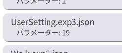
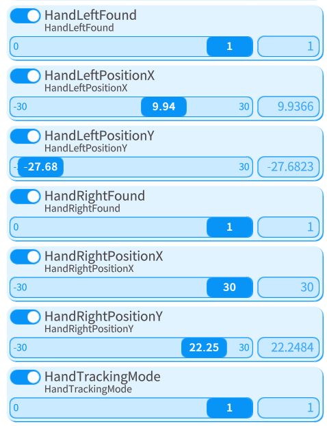

# Minecraft skin to Live2D 

[日本語](index.md)

  
  
Table of Contents

  
- [Minecraft skin to Live2D](#minecraft-skin-to-live2d)
  - [Introduction](#introduction)
  - [How to introduce](#how-to-introduce)
  - [About the movement of the model](#about-the-movement-of-the-model)
  - [About Tracking](#about-tracking)
    - [hand tracking](#hand-tracking)
  - [About Screen Buttons](#about-screen-buttons)
  - [About key bindings and parameters](#about-key-bindings-and-parameters)
    - [If you want to turn off click and keyboard actions](#if-you-want-to-turn-off-click-and-keyboard-actions)
    - [If you want to create a new facial expression difference](#if-you-want-to-create-a-new-facial-expression-difference)
    - [Function of each parameter](#function-of-each-parameter)
    - [If you want to make it poseable](#if-you-want-to-make-it-poseable)
  - [About Credit Notation](#about-credit-notation)
  - [Related Links](#related-links)

## Introduction

Thank you for purchasing Minecraft skin to Live2D!  
Here are the instructions on how to use this model.  
If you have any questions about the contents of this page, please contact [samirin](https://x.com/samirin33) by DM.

## How to introduce

It is the same as a normal Live2D model.
Download and unzip the folder as is into VtubeStudio's  
... /StreamingAssets/Live2DModels". /StreamingAssets/Live2DModels” in VtubeStudio.

## About the movement of the model

This model is designed for microscopic distribution, so in addition to basic face tracking, the model can also be used for other purposes.  
The model moves in response to keyboard input. The respective behaviors are as follows.

| Input | Movement |
| Right/Left Click | Wave your hand | Right/Left Click | Wave your hand
| Right or Left Click | Wave |
| W or S | Walk |
| Spacebar | Jump |
| Shift Left | Sneak |

These actions are set by default, but if you want to turn them off, please see
[If you want to turn off click and keyboard actions](#if-you-want-to-turn-off-click-and-keyboard-actions)

## About Tracking

本モデルは高可動域なので各環境に合った感度に設定する事をおすすめします。  
一般的なLive2Dモデルと同様にVtubeStudioのモデル設定欄から実際に動かしながら調整してください。  

> [!TIP]
>   
> フォルダーアイコンから表示する設定をフィルタリングできます。

> [!TIP]
> ゲーム配信は雑談配信等に比べて意識して顔を動かさない限り動きが小さくなりがちなので、  
> 大きめに設定することをおすすめします。
>
> モデルは配信画面下部に配置する方が多数だと思うのでキャリブレーションをする際に  
> 少し顔を下げて基準の角度を高めに設定するのがおすすめです。

又、フェイストラッキングが外れた際はうとうと眠るアニメーションを行います。  
ゲーム内で眠る際に敢えてカメラをふさいで寝てみても面白いかもしれません。  

### hand tracking

[About the movement of the model](#About the movement of the model)
で述べた様に通常時はクリックで手を振ることができますが、ハンドトラッキングを用いることで自由に動かすことができます。  
カメラ設定でハンドトラッキングを有効にした上で[About Screen Buttons](#About Screen Buttons)の紫のボタンを押すことで  
手の位置に応じてモデルの腕が動くようになります。
> [!IMPORTANT]
> ハンドトラッキングモード中はクリックで手を振るアニメーションが無効になります

## About Screen Buttons

本モデルはいくつかのバインドとスクリーンボタンが最初から設定してあります。  

各ボタンのデフォルトの機能はこちらです。

| 番号 | 色 | 機能 |
| --- | --- | --- |
| 1 | 白 | すべての表情をリセット |
| 2 | 赤 | ハート表示 |
| 3 | 青 | グルグル＆青ざめ＆泣き |
| 4 | 黄 | 手を振るアニメーション再生 |
| 5 | 水 | サングラス表示 |
| 6 | 橙 | ヘイロー表示 |
| 7 | 緑 | モデルの基準の向きとライトの向きを反転 |
| 8 | 紫 | ハンドトラッキングモード切替|

これらの設定は必要に応じて自由に変えてもらって構いません。

## About key bindings and parameters

表情差分等の設定は他のLive2Dモデルと同様に表情ファイルエディタでパラメータを設定する事で行う事ができます。  
納品時に設定されているキーバインドは以下のフォルダに分類されています。  

| フォルダ名 | 設定内容 |
| --- | --- |
| moving | クリックやキーボード操作に反応して動作するアニメーションの設定 |
| emotion | 顔まわりの差分やエモーションの設定 |
| accesorry | サングラスやヘイローの追加パーツの設定 |
| etc | ライティングやその他効果の設定 |

### If you want to turn off click and keyboard actions

フォルダアイコンからmovingを選択し、表示された項目を全てOFFにしてください。

### If you want to create a new facial expression difference

表情差分やカスタム要素となるパラメータがどのパラメータかわからない際は、表情ファイルエディタで「UserSetting.exp3.json」の内容でONになっているパラメータから探してみる事をおすすめします。  

### Function of each parameter

表情差分やカスタム要素となる各パラメータの機能一覧です。

| パラメータ名 | 機能 | 値による変化 | デフォルト値 |
| --- | --- | --- | --- |
| `HandTrackingMode` | ハンドトラッキングモードを切り替え | 0で無効化・1で有効化 | 0 |
| `eye_type` | 目の差分を切り替え | 0で非表示・1...4で種類を選択 | 0 |
| `emotion` | 顔の左上に表示されるエモーションの設定 | 0で非表示・1...7で種類を選択 | 0 |
| `heart_hue` | emotionに含まれるハートの色相 | -180~180で色相を選択 | -35 |
| `eye_white` | 瞳を非表示 | 0で通常・1で白目 | 0 |
| `face_blue` | 青ざめの表示 | 0で通常・1で青ざめ | 0 |
| `sunglasses` | サングラスを表示 | 0で非表示・1\~で表示(1で半透明\~1.5で不透明)| 0 |
| `sunglasses_up` | サングラスの高さ | 0で最低位置~1で最高位置 | 0.2 |
| `sunglasses_saturation` | サングラスの彩度 | -180~180で彩度を選択 | 0 |
| `sunglasses_hue` | サングラスの色相 | -180~180で色相を選択 | 0 |
| `halo` | ヘイローの表示 | 0で非表示・1~で表示 | 0 |
| `halo_saturation` | ヘイローの彩度 | -180~180で彩度を選択 | 0.8 |
| `halo_hue` | ヘイローの色相 | -180~180で色相を選択 | 53 |
| `teeth_hide` | 歯の非表示 | 0で表示・1で非表示 | 0 |
| `bigger_head` | 頭部を拡大 | 0で通常~1で拡大 | 0 |
| `bounce` | 動きによるモデル全体の揺れを切り替え | 0で揺れを無効化・1で有効化 | 1 |
| `angle_directlight` | モデルに当たる光の角度 | -180~180で角度を変更 | -60 |
| `light_value` | 光の強さ | 0で最弱~1で最強 | 0.3 |
| `shadow_value` | 影の強さ | 0で最弱~1で最強 | 0.3 |

> [!NOTE]
> 表記について「(数値)・(数値)」の項目は端数を用いた設定ができません。「(数値)~(数値)」の項目は端数を用いた設定ができます。

### If you want to make it poseable

サムネイル等で使用するためにポージングさせたい場合に腕の角度をある程度任意の角度で固定することができます。  
顔の角度等の設定はParamAngleX,Y,Z等からできますが、一般的なLive2Dモデルと同様なので割愛します。  

> 「HandTrackingMode」を「1」に  

> 「HandRightFound」を「1」に  
> 「HandRightPosionX」と「HandRightPosionY」で右腕の角度を設定  

> 「HandLeftFound」を「1」に  
> 「HandLeftPosionX」と「HandLeftPosionY」で左腕の角度を設定

> [!WARNING]
> VtubeStudioの不具合で表情ファイルエディタの編集中に小刻みに震える事がありますが、実際にバインドさせてポーズをとらせた場合には震える現象は起こらないのでご安心ください。

## About Credit Notation

Youtubeの概要欄等のユーザーの目に届く場所に「samirin33」の名前、又は「[https://x.com/samirin33](https://x.com/samirin33)」のリンクを記載してください。

## Related Links

紹介動画　　
[Minecraft skin to Live2D 紹介動画](https://youtu.be/pfZb89plXow)　　

宣伝ツイート(ポスト)　　
[準備中...]()　　
