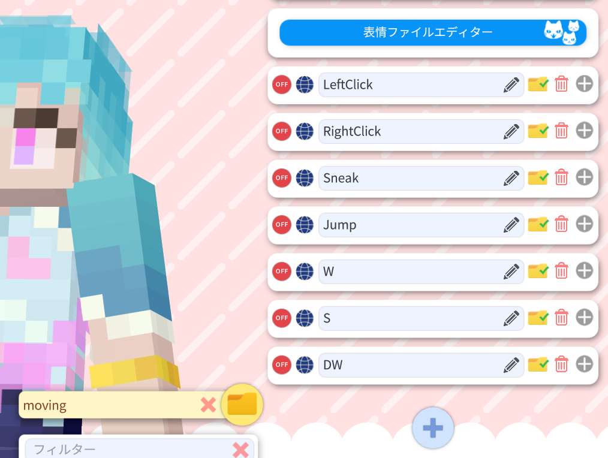

# Minecraft skin to Live2D 

[日本語](README_JP.md)

  
  
Table of Contents

  
- [Minecraft skin to Live2D](#minecraft-skin-to-live2d)
  - [Introduction](#introduction)
  - [How to introduce](#how-to-introduce)
  - [About the movement of the model](#about-the-movement-of-the-model)
  - [About Tracking](#about-tracking)
    - [hand tracking](#hand-tracking)
  - [About Screen Buttons](#about-screen-buttons)
  - [About key bindings and parameters](#about-key-bindings-and-parameters)
    - [If you want to turn off click and keyboard actions](#if-you-want-to-turn-off-click-and-keyboard-actions)
    - [If you want to create a new facial expression difference](#if-you-want-to-create-a-new-facial-expression-difference)
    - [Function of each parameter](#function-of-each-parameter)
    - [If you want to make it poseable](#if-you-want-to-make-it-poseable)
  - [About Credit Notation](#about-credit-notation)
  - [Related Links](#related-links)

## Introduction

Thank you for purchasing Minecraft skin to Live2D!  
Here are the instructions on how to use this model.  
If you have any questions about the contents of this page, please contact [samirin](https://x.com/samirin33) by DM.

## How to introduce

It is the same as a normal Live2D model.
Download and unzip the folder as is into VtubeStudio's  
`.../StreamingAssets/Live2DModels"./StreamingAssets/Live2DModels` in VtubeStudio.

## About the movement of the model

Since this model is designed for Minecraft streaming, the model moves in response to keyboard input in addition to basic face tracking. Each of these actions is shown below.

| Input | Movement |
| --- | --- |
| Right or Left Click | Use hand |
| W or S | Walk |
| Spacebar | Jump |
| Shift Left | Sneak |

These actions are set by default, but if you want to turn them off, please see
[If you want to turn off click and keyboard actions](#if-you-want-to-turn-off-click-and-keyboard-actions)

## About Tracking

Since this model has a high range of motion, it is recommended to set the sensitivity to a level appropriate for each environment.  
As with most Live2D models, please adjust the sensitivity while actually moving the model in the model settings section of VtubeStudio.  

> [!TIP]
>   
> You can filter the settings to be displayed from the folder icon.

> [!TIP]
> We recommend that you set a larger size for game distribution than for chat distribution, because the movement tends to be smaller than in chat distribution unless you consciously move your face.  
> Since most of the models are placed at the bottom of the screen, it is recommended to lower the face a little when calibrating and set the angle of the reference to a higher level.

Also, when the face tracking is off, the model will animate dozing off.  
It may be interesting to try to sleep with the camera blocked when sleeping in the game.  

### hand tracking

As mentioned in [About the movement of the model](#about-the-movement-of-the-model), normally you can shake your hand by clicking on it, but by using hand tracking, you can move it freely.  
By enabling hand tracking in the camera settings and pressing the purple button in [About Screen Buttons](#about-screen-buttons), the model's arms will move according to the position of the hands.

> [!IMPORTANT]
> While in hand tracking mode, the hand waving animation is disabled with a click.

## About Screen Buttons

This model has several bindings and screen buttons set up from the beginning.  

This is the default function of each button.

| Number | Color | Function |
| --- | --- | --- |
| 1 | white | Reset all expressions |
| 2 | red | Heart enable |
| 3 | blue | Disheartened , Turn pale and Cry |
| 4 | yellow | Play the waving animation |
| 5 | light blue | Sunglasses enable |
| 6 | orenge | Halo enable |
| 7 | green | Reverses the orientation of the model's reference and the orientation of the lights |
| 8 | purple | Hand tracking mode enable |

You are free to change these settings as needed.

## About key bindings and parameters

As with other Live2D models, facial expression differences and other settings can be made by setting parameters in the facial Expression Editor.  
The key bindings set at the time of delivery are categorized in the following folders.  

| Folder name | Configuration details |
| --- | --- |
| `moving` | Setting up that act in response to clicks and keyboard actions |
| `emotion` | Setting up facial expressions and emoticons around the face |
| `accesorry` | Setting up additional parts for sunglasses and Halo |
| `etc` | Setting up lighting and other effects |

### If you want to turn off click and keyboard actions

Select `moving` from the folder icon and turn off all items displayed.

### If you want to create a new facial expression difference

If you are not sure which parameter is the expression difference or custom element, we recommend that you look for it in the Expression Editor, starting with the parameter that is ON in the contents of “UserSetting.exp3.json”.   

### Function of each parameter

Below is a list of functions for each parameter that can be expression differences or custom elements.

| Parameter name | Function | Change by value | default value |
| --- | --- | --- | --- |
| `HandTrackingMode` | Switching hand tracking mode | 0 to disable, 1 to enable | 0 |
| `eye_type` | Switching eye differential | 0 to hide, 1...4 to select type | 0 |
| `emotion` | Emotion settings | 0 to hide, 1...7 to select type | 0 |
| `heart_hue` | Hue of hearts in emotion | Select hue with -180\~180 | -35 |
| `eye_white` | Hide eyes | 0 to normal, 1 to hide pupils | 0 |
| `face_blue` | Pallor enable | 0 to normal, 1 to blue | 0 |
| `sunglasses` | Sunglasses enable | 0 to hidden, 1\~ visible (1 for translucent, \~1.5 to opaque)| 0 |
| `sunglasses_up` | Sunglass height | 0 to lowest position \~ 1 to highest position | 0.2 |
| `sunglasses_saturation` | Saturation of sunglasses | Select saturation with -180\~180 | 0 |
| `sunglasses_hue` | Hue of sunglasses | Select hue with -180\~180 | 0 |
| `halo` | Halo enable | 0 to hide, 1~ to show | 0 |
| `halo_saturation` | Halo Saturation | Select saturation with -180\~180 | 0.8 |
| `halo_hue` | Halo Hue | Select hue with -180\~180 | 53 |
| `teeth_hide` | Hide teeth | 0 to show, 1~ to hide | 0 |
| `bigger_head` | Bigger head | 0 to Normal ~ 1 to Enlarged | 0 |
| `bounce` | Switches the shaking of the entire model due to movement | 0 to disable shaking, 1 to enable | 1 |
| `angle_directlight` | Angle of light hitting the model | Change angle at -180~180 | -60 |
| `light_value` | Light intensity | 0 to weakest, \~ 1 to strongest | 0.3 |
| `shadow_value` | Shadow Strength | 0 to weakest, \~ 1 to strongest | 0.3 |

> [!NOTE]
> For notation, “(Num) and (Num)” items cannot be set using fractions. The items “(Num)~(Num)” can be set using fractions.

### If you want to make it poseable

The arm angle can be fixed at any desired angle to some extent when posing for use in thumbnails, etc.  
The angle of the face can be set using ParamAngleX, Y, Z, etc. However, this is similar to general Live2D models, so I will skip this section.  

> 「HandTrackingMode」to「1」  

> 「HandRightFound」to「1」  
> 「HandRightPosionX」and「HandRightPosionY」Set the angle of the right arm  

> 「HandLeftFound」to「1」  
> 「HandLeftPosionX」and「HandLeftPosionY」Set the angle of the left arm

> [!WARNING]
> A glitch in VtubeStudio may cause a small tremor while editing the expression file editor, but rest assured that the tremor does not occur when the camera is actually bound and posed.

## About Credit Notation

Please include the name “samirin33” or a link to “[https://x.com/samirin33](https://x.com/samirin33)” in the summary section of Youtube or other places where users can see it.

## Related Links

Introduction Video　
[Minecraft skin to Live2D 紹介動画](https://youtu.be/pfZb89plXow)　　

publicity post　
[Minecraft skin to Live2D 宣伝ポスト](https://x.com/samirin33/status/1799373300507816096)　　