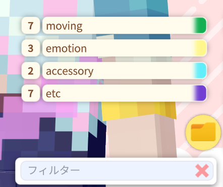

# Minecraft_skin_to_Live2D

  
  
目次

  
  - [はじめに](#はじめに)  
  - [導入方法](#導入方法)  
  - [モデルの動きについて](#モデルの動きについて)  
  - [トラッキングについて](#トラッキングについて)  
  -   
  -   
  -   

## はじめに

この度はMinecraft skin to Live2Dをご購入いただきありがとうございます！  
ここでは本モデルの使い方を説明します。  
もしここに書かれている内容等で不明な点がございましたら[samirin](https://x.com/samirin33)のDMまでご相談ください。

## 導入方法

通常のLive2Dモデルと同様です。
ダウンロード&解凍したフォルダをそのままVtubeStudioの  
「.../StreamingAssets/Live2DModels」に入れてください。

## モデルの動きについて

本モデルはマイクラ配信を想定した設計になっているので基本的なフェイストラッキング以外にも  
キーボード入力に応じてモデルが動きます。それぞれの動作は以下の通りです。

| 入力 | 動作 |
| --- | --- |
| 右・左クリック | 手を振る |
| WまたはS | 歩く |
| スペースキー | ジャンプ |
| 左シフト | スニーク |

これらの動作はデフォルトで設定されていますが、もしオフにしたい場合は
[キーバインドについて](#キーバインドについて)
をご覧ください。

## トラッキングについて

本モデルは高可動域なので各環境に合った感度に設定する事をおすすめします。  
他のLive2Dモデルと同様にVtubeStudioのモデル設定欄から実際に動かしながら調整してください  

フォルダーアイコンから表示する設定にフィルタをかけることができます。

> [!TIP]
> ゲーム配信は雑談配信等に比べて意識して顔を動かさない限り動きが小さくなりがちなので、  
> 大きめに設定することをおすすめします。
>
> モデルは配信画面下部に配置する方が多数だと思うのでキャリブレーションをする際に  
> 少し顔を下げて基準の角度を高めに設定するのがおすすめです。

又、フェイストラッキングが外れた際はうとうとして眠るアニメーションを用意してあります。  
ゲーム内で眠る際に敢えてカメラをふさいで寝てみても面白いかもしれません。  

### ハンドトラッキング

[モデルの動きについて](#モデルの動きについて)
で述べた様に通常時はクリックで手を振ることができますが、ハンドトラッキングを用いることで自由に動かすことができます。  
カメラ設定でハンドトラッキングを有効にした上で[スクリーンボタンについて](#スクリーンボタンについて)の紫のボタンを押すことで  
手の位置に応じてモデルの腕が動くようになります。  
ハンドトラッキングモード中はクリックで手を振るアニメーションが無効になります

## スクリーンボタンについて

本モデルはいくつかのバインドとスクリーンボタンが最初から設定してあります。  

各ボタンのデフォルトの機能はこちらです。

| 番号 | 色 | 機能 |
| --- | --- | --- |
| 1 | 白 | すべての表情をリセット |
| 2 | 赤 | ハート表示 |
| 3 | 青 | グルグル＆青ざめ＆泣き |
| 4 | 黄 | 手を振るアニメーション再生 |
| 5 | 水 | サングラス表示 |
| 6 | 橙 | ヘイロー表示 |
| 7 | 緑 | モデルの基準の向きとライトの向きを反転 |
| 8 | 紫 | ハンドトラッキングモード切替|

これらの設定は必要に応じて自由に変えてもらって構いません。

## キーバインドとパラメータについて

表情差分等の設定は他のLive2Dモデルと同様に表情ファイルエディタでパラメータを設定する事で行う事ができます。  
納品時に設定されているキーバインドは以下のフォルダに分類されています。  

| フォルダ名 | 設定内容 |
| --- | --- |
| moving | クリックやキーボード操作に反応して動作するアニメーションの設定 |
| emotion | 顔まわりの差分やエモーションの設定 |
| accesorry | サングラスやヘイローの追加パーツの設定 |
| etc | ライティングやその他効果の設定 |

### 新しい表情差分を作成したい場合

表情差分やカスタム要素となるパラメータがどのパラメータかわからない際は、表情ファイルエディタで「UserSetting.exp3.json」の内容でONになっているパラメータから探してみる事をおすすめします。  

### 各パラメータの機能

「UserSetting.exp3.json」に含まれている各パラメータの機能一覧です。

| パラメータ名 | 機能 |  | デフォルト値 |
| --- | --- | --- | --- |
| HandTrackingMode | ハンドトラッキングモードを切り替え |  | 0 |
| eye_type | 目の差分を切り替え | 0で非表示・1~4で種類を選択 | 0 |
| emotion | 顔の左上に表示されるエモーションの設定 | 0で非表示・1~7で種類を選択 | 0 |
| heart_hue | emotionに含まれるハートの色相 | -180~180で色相を選択 | -35 |
| eye_white | 瞳を非表示 | 0で通常・1で白目 | 0 |
| face_blue | 青ざめの表示 | 0で通常・1で青ざめ | 0 |
| sunglasses | サングラスを表示 | 0で非表示・1~で表示(1で半透明~1.5で不透明)| 0 |
| sunglasses_up | サングラスの高さ | 0で最低位置~1で最高位置 | 0.2 |
| sunglasses_saturation | サングラスの彩度 | -180~180で彩度を選択 | 0 |
| sunglasses_hue | サングラスの色相 | -180~180で色相を選択 | 0 |
| halo | ヘイローの表示 | 0で非表示・1~で表示 | 0 |
| halo_saturation | ヘイローの彩度 | -180~180で彩度を選択 | 0.8 |
| halo_hue | ヘイローの色相 | -180~180で色相を選択 | 53 |
| teeth_hide | 歯の非表示 | 0で表示・1~で非表示 | 0 |
| bigger_head | 頭部を拡大 | 0で通常~1で拡大 | 0 |
| bounce | 動きによるモデル全体の揺れを切り替え | 0で揺れを無効化・1で有効化 | 1 |
| angle_directlight | モデルに当たる光の角度 | -180~180で角度を変更 | -60 |
| light_value | 光の強さ | 0で最弱~1で最強 | 0.3 |
| shadow_value | 影の強さ | 0で最弱~1で最強 | 0.3 |
